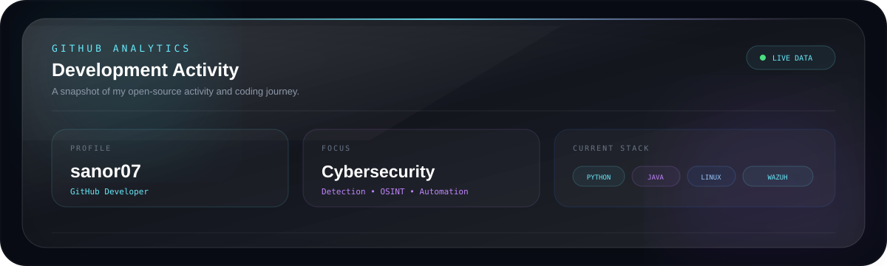
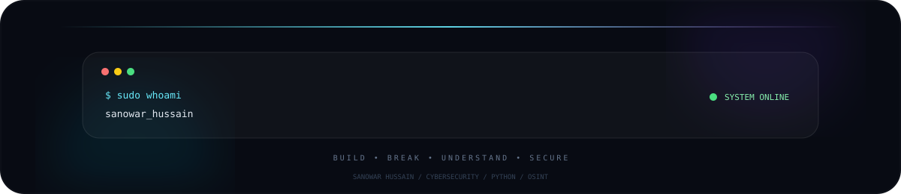

<!-- ========================================================= -->

<!--                    SANOWAR HUSSAIN                        -->

<!--                 GITHUB PROFILE README                     -->

<!-- ========================================================= -->

  

 

<!-- ABOUT -->

<h2 align="center">◈ ABOUT ME</h2>

  Cybersecurity enthusiast • Python developer • OSINT explorer

  I build security tools, automation systems, web applications,
   
  and practical labs to understand how technology works from the inside.

 

  

  

  

  

 

  

---

<!-- CURRENT FOCUS -->

<h2 align="center">◈ CURRENT FOCUS</h2>

  <b>Cybersecurity • SOC Operations • OSINT • Automation • Full-Stack Development</b>

 

|       AREA      | CURRENT WORK                                   |
| :-------------: | :--------------------------------------------- |
|   🔐 Security   | SIEM, Detection Engineering, Linux, Networking |
|    🛰️ OSINT    | ReconX Intelligence Framework                  |
|      🧠 AI      | MIOR Local AI Assistant                        |
|      🌐 Web     | Full-stack and role-based platforms            |
| 🛠️ Development | Python, Java, React, FastAPI                   |
|     🧪 Labs     | Wazuh Detection & Blue Team Lab                |

---

<!-- TECH STACK -->

<h2 align="center">◈ TECHNOLOGY STACK</h2>

  

 

  
  
  
  

---

<!-- PROJECT SHOWCASE -->

<h2 align="center">◈ PROJECT SHOWCASE</h2>

  Selected projects • security research • experiments • applications

 

<!-- RECONX -->

  

  

 

<!-- MIOR -->

  

  

 

<!-- WAZUH -->

  

  

 

<!-- RESUME BUILDER -->

  

  

 

<!-- COLLEGE PORTAL -->

  

  

 

<!-- FACE ATTENDANCE -->

  

  

 

<!-- PASSWORD ANALYZER -->

  

  

 

<!-- EMAIL AUTOMATION -->

  

  

 

<!-- PORTFOLIO -->

  

  

  

---

<!-- GITHUB ACTIVITY -->

<h2 align="center">◈ GITHUB ACTIVITY</h2>

  

 

  

---

<!-- CONTRIBUTION -->

<h2 align="center">◈ CONTRIBUTION SIGNAL</h2>

  

---

<!-- PROFILE STATS -->

---

<!-- CONNECT -->

<h2 align="center">◈ CONNECT</h2>

  

  

  

  

---

<!-- TERMINAL -->

  

 

  
    Built with curiosity, caffeine, questionable debugging decisions,
    and an unreasonable number of terminal windows.
  

  © Sanowar Hussain • 2026

