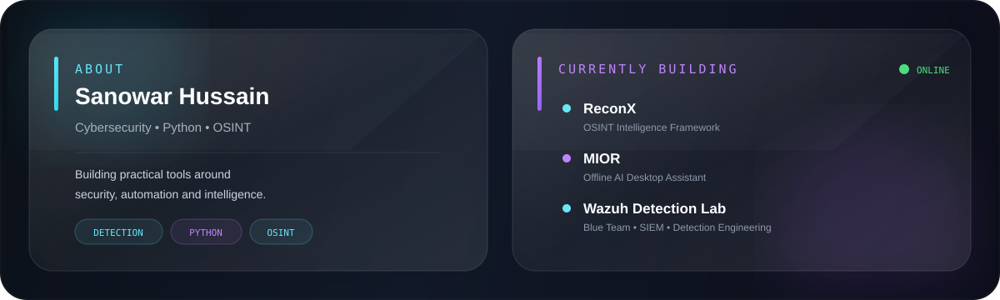

<div align="center">


<br>


</div>

<br>

---

<div align="center">

## ◈ SYSTEM STATUS

</div>

<table>
<tr>

<td align="center" width="25%">

### 🔐 SECURITY

Detection Engineering

</td>

<td align="center" width="25%">

### 🐍 PYTHON

Automation & Tools

</td>

<td align="center" width="25%">

### 🛰️ OSINT

Intelligence Research

</td>

<td align="center" width="25%">

### 🤖 AI

Local Automation

</td>

</tr>
</table>

---

<div align="center">



</div>

---

# ◈ CURRENTLY BUILDING

<table>
<tr>

<td width="50%" valign="top">

### 🔍 ReconX

**OSINT Intelligence Framework**

```text
STATUS      ████████████████░░░░  80%

STACK
Python
CustomTkinter
OSINT
APIs
